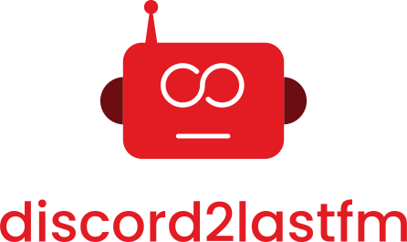

	

Last.fm scrobbler for songs played by bots on your Discord server.

---

## How it works

This bot scrobbles songs played by other bots on your Discord server to Last.fm. It will automatically scrobble if the user is on the same audio channel as the bot, on any server that this bot is added to.

To enable it for you, you'll need to send a message to the bot with _-d2lfm register_ and log in with your Last.fm account.

## Adding to your server

Just [click here to add to your server](https://discord.com/oauth2/authorize?client_id=739266400476201061&permissions=511040&scope=bot) :)

## Running from source

This project uses [discord.js](https://discord.js.org/) and needs [Node.js](https://nodejs.org) LTS to be installed on your machine.

First, install the project dependencies running:

    npm install

Then, on the project root folder, create a new `.env` file and copy the contents of the `.env.template`.

Replace the following fields:
- `<your-discord-bot-token>`: The Discord token for your bot, which can be obtained from the [Discord developer portal](https://discordapp.com/developers/applications). 
- `<your-spotify-app-client-id>` and `<your-spotify-app-client-secret>`: Tokens from your Spotify integration, which can be obtained on the [Spotify developer dashboard](https://developer.spotify.com/dashboard/applications). This bot uses the Spotify API to look for track information.
- `<your-lastfm-api-key>` and `<your-lastfm-shared-secret>`: The tokens from Last.fm API, which can be obtained [here](https://www.last.fm/api/account/create).
- `<service-account-key-file-base64>`: A service account key file encoded in base64 from a Firebase project. This bot uses Firebase Firestore to store user data.

Remember to keep these tokens in a safe place.

You can also change the bot prefix by replacing `-d2lfm `.

## Issues

If you find any problems during the bot usage, feel free to open an [issue](https://github.com/Erick2280/discord2lastfm/issues) here on GitHub. PRs are welcome too!

You can also contact me on Discord :) My username is **Erick2280#4015**.
